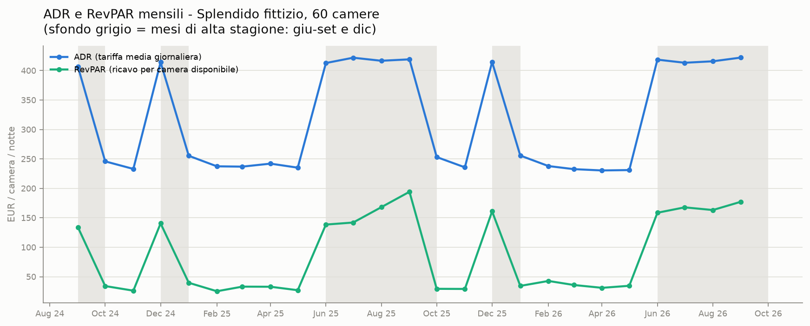
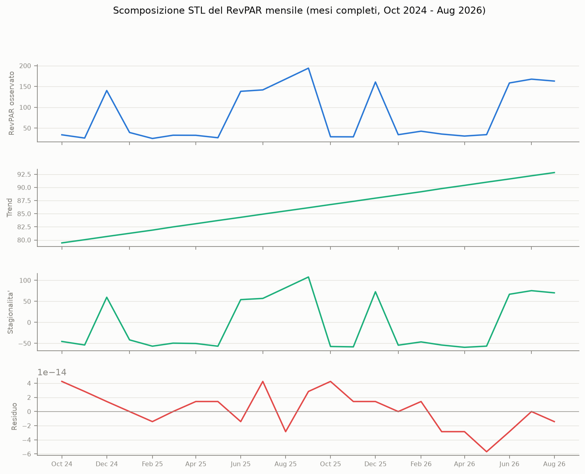
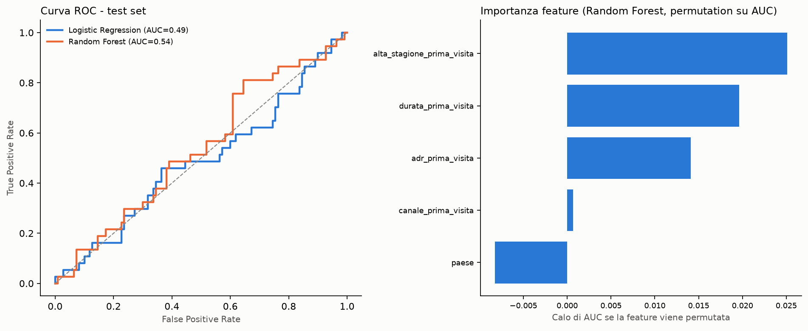
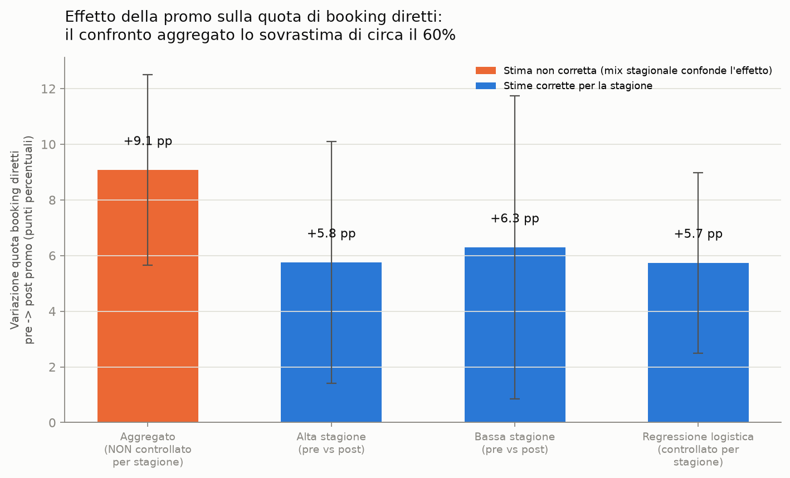

# Revenue Management & Guest Retention — Report Finale

*Analisi su 24 mesi di dati (set 2024 – set 2026), hotel di lusso da 60 camere.*

## Executive Summary

Il business è, come atteso per una struttura di lusso stagionale, fortemente concentrato: le tariffe e i ricavi per camera disponibile in alta stagione (giugno-settembre e dicembre) sono 5-6 volte quelli della bassa stagione, ed è questo — più di qualunque altro fattore — a determinare l'andamento dei ricavi mese per mese. La promozione sulle prenotazioni dirette lanciata sei mesi fa funziona davvero: aumenta la quota di booking diretti di circa 5,7 punti percentuali (statisticamente significativo), ma non dei ~9 punti che un confronto grezzo "prima vs dopo" suggerirebbe — quel numero più alto è in parte un'illusione dovuta al fatto che gli ultimi sei mesi contengono più mesi di alta stagione, che genera più booking diretti a prescindere dalla promo. Sul fronte della fidelizzazione, circa un quarto degli ospiti torna entro 18 mesi dalla prima visita, con una propensione più alta per chi ha soggiornato in alta stagione o prenotato direttamente — ma il segnale predittivo individuale è ancora troppo debole per costruire su di esso un punteggio di fedeltà affidabile. Di seguito le tre raccomandazioni operative con i numeri a supporto, e una sezione che spiega onestamente i limiti di questa analisi.

## Grafici chiave

### 1. ADR e RevPAR mensili

*ADR (tariffa media giornaliera) e RevPAR (ricavo per camera disponibile) mese per mese, con le bande grigie a indicare i mesi di alta stagione (giu-set e dic). Il RevPAR passa da 25-40€ in bassa stagione a 140-195€ in alta stagione.*

### 2. Scomposizione stagionale (STL)

*Il RevPAR mensile scomposto in trend, stagionalità e residuo (mesi completi, ott 2024 – ago 2026). La stagionalità spiega il 96,7% della varianza mese su mese; il trend mostra un +16,8% ma va letto con cautela (vedi Limiti).*

### 3. Confronto modelli di previsione del ritorno ospite

*Curva ROC e importanza delle feature per i due modelli di classificazione (Logistic Regression vs Random Forest) addestrati a prevedere se un ospite tornerà entro 18 mesi. AUC 0,49-0,54: segnale presente ma debole.*

### 4. Effetto della promo booking diretto

*Confronto tra la stima aggregata (distorta dal mix stagionale, in arancio) e le stime corrette per la stagione (in blu): il confronto grezzo sovrastima l'effetto della promo di circa il 60%.*

## Raccomandazioni

**1. Comunicare l'effetto reale della promo booking diretto (+5,7 punti percentuali, non +9,1) e valutarne l'espansione.**
La regressione logistica controllata per stagione stima l'effetto della promo in +5,7 punti percentuali di quota diretta (odds ratio 1,295, p=0,0006) — un risultato solido e statisticamente significativo, anche se più modesto del +9,1 pp che emerge da un confronto grezzo pre/post. Ogni punto di quota diretta spostato dalle OTA fa risparmiare la commissione OTA (tipicamente 15-20%): vale la pena valutare un'estensione della promo o un rinnovo, ma pianificando il budget sul numero corretto, non su quello gonfiato.

**2. Investire nella destagionalizzazione: la bassa stagione (8 mesi su 12) genera un RevPAR 5-6 volte inferiore all'alta stagione.**
Il RevPAR scende sotto i 40€ per 8 mesi l'anno contro i 140-195€ dei mesi di punta (Grafico 1), e la stagionalità da sola spiega il 96,7% della variazione mensile dei ricavi (Grafico 2). Pacchetti dedicati, partnership locali o eventi per i mesi di bassa stagione avrebbero probabilmente un impatto sui ricavi complessivi maggiore di qualunque ottimizzazione tariffaria in alta stagione, dove la domanda è già forte.

**3. Costruire un programma di fidelizzazione mirato agli ospiti di alta stagione e ai soggiorni più lunghi, ma non ancora un punteggio predittivo individuale.**
Il tasso di ritorno entro 18 mesi è del 25,3% (149 ospiti su 588 analizzati), ed è più alto per chi prenota diretto (34% vs 22% OTA) e per chi soggiorna in alta stagione (31% vs 21%). Questi due segmenti sono target naturali per un follow-up post-soggiorno o un'offerta di ritorno. Il modello di classificazione, però, ha un AUC di appena 0,49-0,54 (poco meglio del caso): è utile per orientare la strategia a livello di segmento, non ancora per assegnare un punteggio di probabilità a un singolo ospite.

## Perché l'AUC è debole e cosa proverei dopo

In breve: il tetto è nei dati disponibili, non nel modello.

Il segnale debole è plausibilmente un limite intrinseco dei dati disponibili, non uno sbaglio nello script. Il modello usa già le uniche quattro feature a cui il generatore associa un effetto reale sul ritorno (canale di prenotazione, stagione, paese, durata del soggiorno) — l'ADR alla prima visita è stato deliberatamente lasciato non informativo, e infatti risulta la feature meno importante in entrambi i modelli. Il problema è che questi effetti sono piccoli e additivi su una probabilità di base già bassa (~15%, con incrementi dell'ordine di pochi punti percentuali per ciascun fattore): la maggior parte degli ospiti finisce con una probabilità di ritorno stimata compresa in una fascia stretta, diciamo 15-40%, e da quella probabilità viene estratto un unico esito binario per ciascuno. Anche un modello che recuperasse esattamente le probabilità "vere" non potrebbe avvicinarsi a un AUC alto, perché il rapporto segnale/rumore a livello di singolo ospite è strutturalmente basso. A questo si aggiunge un campione modesto (588 ospiti, 149 repeat, ridotto a un test set di circa 147 righe): parte dell'oscillazione 0,49-0,54 tra i due modelli è probabilmente anche rumore di stima, non una differenza sostanziale di qualità.

In un contesto reale le feature che aiuterebbero di più sono quelle che qui non esistono per costruzione, perché il modello guarda solo alla prima visita. Le più promettenti: storico comportamentale vero (non c'è nulla di "ospite ha già dimostrato di tornare" perché per definizione stiamo prevedendo la prima transizione), spesa F&B e ancillare oltre alla camera (qui `net_revenue_eur` è solo ricavo camera, e la spesa extra è spesso un indicatore di engagement migliore del prezzo pagato), segnali di soddisfazione post-soggiorno (recensioni, NPS, reclami), dettaglio più fine sul canale di acquisizione (OTA specifica, campagna, prenotazione diretta via telefono vs sito), iscrizione a un programma fedeltà, distanza geografica o motivo del viaggio (leisure/business/occasione speciale — qui solo proxato debolmente da `cibo_preferito`, che è una preferenza alimentare, non un motivo di visita), e composizione del gruppo. Vale la pena essere onesti sul fatto che alcune di queste (spesa F&B, NPS) sono anche le più costose da raccogliere in modo sistematico, quindi non sono un miglioramento a costo zero.

Cambiare modello difficilmente risolverebbe il problema da solo. Ho già confrontato una regressione logistica (ipotesi di effetti additivi, coerente con come il generatore costruisce la probabilità) con una Random Forest (che può catturare interazioni non lineari): il guadagno della RF è marginale (0,54 vs 0,49), il che è coerente con un tetto imposto dai dati più che con un problema di forma funzionale del modello. Passare a gradient boosting o fare tuning più aggressivo degli iperparametri rischia di ottimizzare rumore nel test set, non segnale reale. Due direzioni mi sembrano più sensate di "un modello più sofisticato": primo, trattare il problema come stima di probabilità calibrata (valutata con Brier score o calibration curve) invece che come classificazione binaria valutata solo su AUC — il caso d'uso reale, come già notato nel report, è targeting a livello di segmento, non scoring del singolo ospite, quindi la metrica dovrebbe riflettere quello. Secondo, un taglio del target diverso: un modello di sopravvivenza (Cox proportional hazards — un approccio che modella *quando* un ospite torna, non solo *se* torna) userebbe l'informazione temporale che ora viene buttata via binarizzando a 18 mesi, e gestirebbe la censura in modo più naturale di un cutoff fisso.

Non minimizzerei il risultato riformulandolo come "va bene così perché è solo un segmento": un AUC vicino a 0,5 per il modello lineare significa che, con le feature attuali, non c'è quasi separazione utile a livello individuale, ed è corretto che il report lo dichiari come limite reale (Raccomandazione 3) invece di presentare il modello come pronto per uno scoring di fedeltà. Il valore di questo esercizio è aver isolato dove sta il tetto — nei dati disponibili, non nella scelta tra Logistic Regression e Random Forest — così il prossimo investimento (se il business lo giustifica) va nella raccolta di segnali comportamentali post-soggiorno, non in un tuning più aggressivo del modello attuale.

## Limiti dell'analisi

Il dataset è sintetico: la stagionalità è quasi perfettamente deterministica (residuo STL ≈ 0), mentre un hotel reale avrebbe rumore da eventi, meteo e domanda imprevedibile — il trend "+16,8%" andrebbe verificato su una storia più lunga (23 mesi coprono appena ~2 cicli stagionali). Il 14,7% delle prenotazioni ha un'identità ospite ambigua per omonimia (nessun ID univoco condiviso tra le fonti) e queste righe sono state escluse dalla segmentazione, riducendo il campione utile a 588 ospiti — abbastanza per stimare un effetto medio, non abbastanza per un modello di scoring affidabile a livello individuale. In produzione, il primo miglioramento da fare non è un modello più sofisticato, ma raccogliere un guest ID o l'email anche nel sistema di prenotazione.
